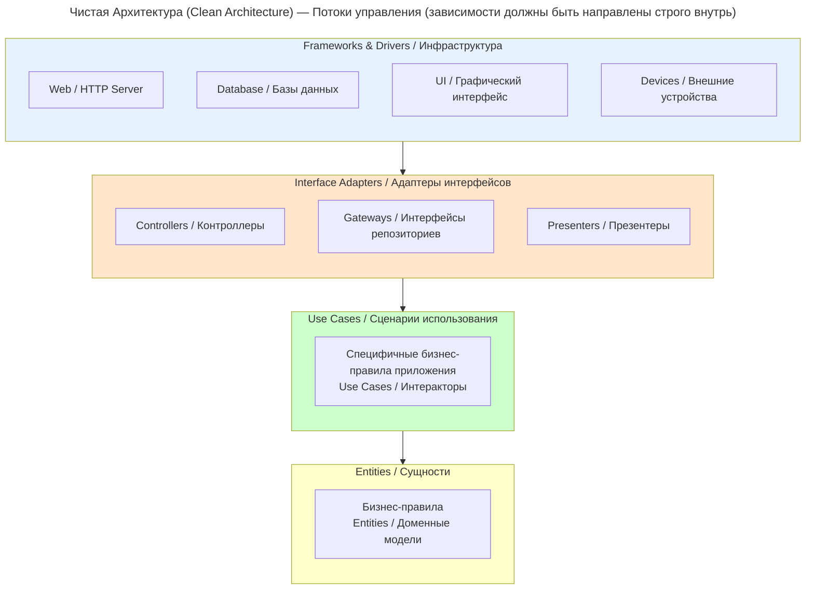

```mermaid
---
title: "Чистая Архитектура (Clean Architecture)\n — Потоки управления\n (зависимости должны быть направлены строго внутрь)"
---

flowchart TB

    subgraph L1["Entities / Сущности"]
        direction TB
        style L1 fill:#ffffcc
        DOM["Бизнес-правила<br/>Entities / Доменные модели"]
    end

    subgraph L2["Use Cases / Сценарии использования"]
        direction TB
        style L2 fill:#ccffcc
        APP["Специфичные бизнес-правила приложения<br/>Use Cases / Интеракторы"]
    end

    subgraph L3["Interface Adapters / Адаптеры интерфейсов"]
        direction TB
        style L3 fill:#ffe6cc
        CON["Controllers / Контроллеры"]
        GW["Gateways / Интерфейсы репозиториев"]
        PR["Presenters / Презентеры"]
    end

    subgraph L4["Frameworks & Drivers / Инфраструктура"]
        direction TB
        style L4 fill:#e6f2ff
        TCP["Web / HTTP Server"]
        DB["Database / Базы данных"]
        UI["UI / Графический интерфейс"]
        EXT["Devices / Внешние устройства"]
    end

L4 --> L3
L3 --> L2
L2 --> L1
```
