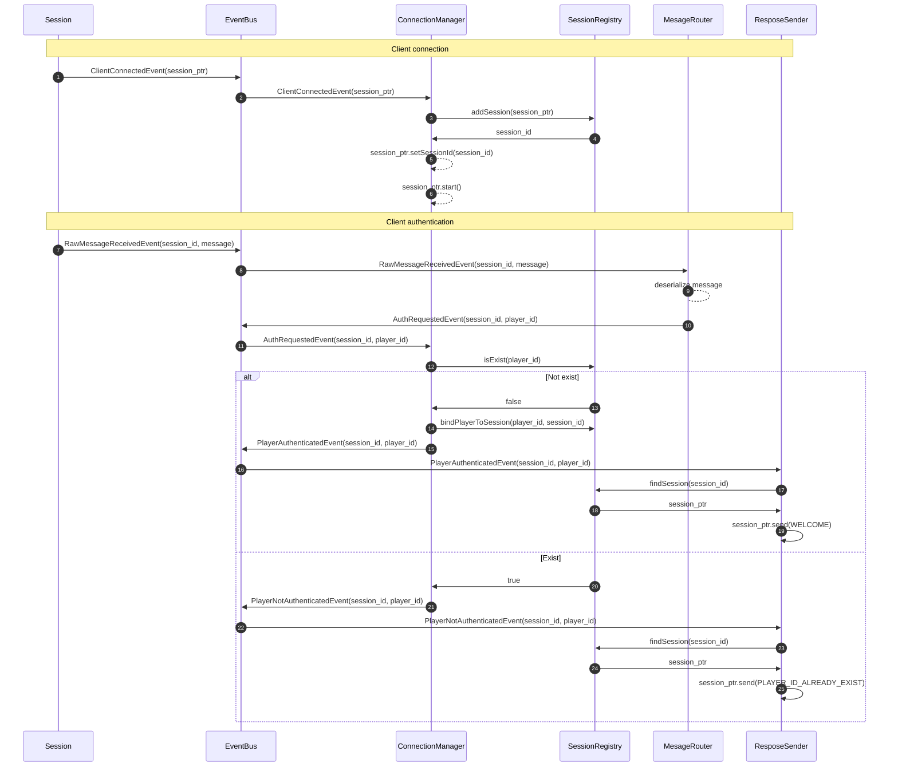
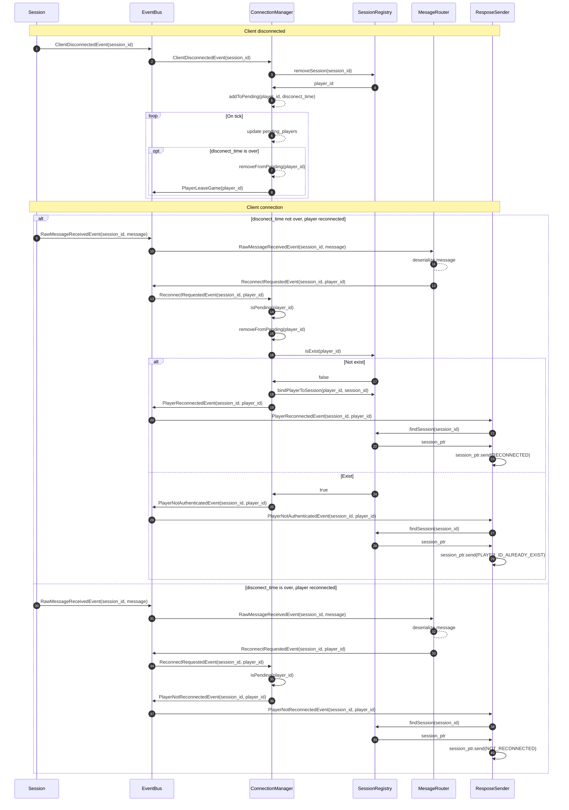

```mermaid
sequenceDiagram
autonumber

participant S as Session
participant EB as EventBus
participant CM as ConnectionManager
participant SR as SessionRegistry
participant MR as MesageRouter
participant RS as ResposeSender

Note over S,RS: Client connection

S ->> EB: ClientConnectedEvent(session_ptr)
EB ->> CM: ClientConnectedEvent(session_ptr)
CM ->> SR: addSession(session_ptr)
SR ->> CM: session_id
CM -->> CM: session_ptr.setSessionId(session_id)
CM -->> CM: session_ptr.start()

Note over S,RS: Client authentication

S ->> EB: RawMessageReceivedEvent(session_id, message)
EB ->> MR: RawMessageReceivedEvent(session_id, message)
MR --> MR: deserialize message
MR ->> EB: AuthRequestedEvent(session_id, player_id)
EB ->> CM: AuthRequestedEvent(session_id, player_id)
CM ->> SR: isExist(player_id)

alt Not exist
  SR ->> CM: false
  CM ->> SR: bindPlayerToSession(player_id, session_id)
  CM ->> EB: PlayerAuthenticatedEvent(session_id, player_id)
  EB ->> RS: PlayerAuthenticatedEvent(session_id, player_id)
  RS ->> SR: findSession(session_id)
  SR ->> RS: session_ptr
  RS ->> RS: session_ptr.send(WELCOME)
else Exist
  SR ->> CM: true
  CM ->> EB: PlayerNotAuthenticatedEvent(session_id, player_id)
  EB ->> RS: PlayerNotAuthenticatedEvent(session_id, player_id)
  RS ->> SR: findSession(session_id)
  SR ->> RS: session_ptr
  RS ->> RS: session_ptr.send(PLAYER_ID_ALREADY_EXIST)
end
```

```mermaid
sequenceDiagram
autonumber

participant S as Session
participant EB as EventBus
participant CM as ConnectionManager
participant SR as SessionRegistry
participant MR as MesageRouter
participant RS as ResposeSender

Note over S,RS: Client disconnected

S ->> EB: ClientDisconnectedEvent(session_id)
EB ->> CM: ClientDisconnectedEvent(session_id)
CM ->> SR: removeSession(session_id)
SR ->> CM: player_id
CM -->> CM: addToPending(player_id, disconect_time)

loop On tick
  CM -->> CM: update pending_players
  
  opt disconect_time is over
    CM -->> CM: removeFromPending(player_id)
    CM ->> EB: PlayerLeaveGame(player_id)
  end

end

Note over S,RS: Client connection

alt disconect_time not over, player reconnected

  S ->> EB: RawMessageReceivedEvent(session_id, message)
  EB ->> MR: RawMessageReceivedEvent(session_id, message)
  MR --> MR: deserialize message
  MR ->> EB: ReconnectRequestedEvent(session_id, player_id)
  EB ->> CM: ReconnectRequestedEvent(session_id, player_id)
  CM ->> CM: isPending(player_id)
  CM ->> CM: removeFromPending(player_id)
  CM ->> SR: isExist(player_id)
  
  alt Not exist
    SR ->> CM: false
    CM ->> SR: bindPlayerToSession(player_id, session_id)
    CM ->> EB: PlayerReconnectedEvent(session_id, player_id)
    EB ->> RS: PlayerReconnectedEvent(session_id, player_id)
    RS ->> SR: findSession(session_id)
    SR ->> RS: session_ptr
    RS ->> RS: session_ptr.send(RECONNECTED)
  else Exist
    SR ->> CM: true
    CM ->> EB: PlayerNotAuthenticatedEvent(session_id, player_id)
    EB ->> RS: PlayerNotAuthenticatedEvent(session_id, player_id)
    RS ->> SR: findSession(session_id)
    SR ->> RS: session_ptr
    RS ->> RS: session_ptr.send(PLAYER_ID_ALREADY_EXIST)
  end

else disconect_time is over, player reconnected
  S ->> EB: RawMessageReceivedEvent(session_id, message)
  EB ->> MR: RawMessageReceivedEvent(session_id, message)
  MR --> MR: deserialize message
  MR ->> EB: ReconnectRequestedEvent(session_id, player_id)
  EB ->> CM: ReconnectRequestedEvent(session_id, player_id)
  CM ->> CM: isPending(player_id)
  CM ->> EB: PlayerNotReconnectedEvent(session_id, player_id)
  EB ->> RS: PlayerNotReconnectedEvent(session_id, player_id)
  RS ->> SR: findSession(session_id)
  SR ->> RS: session_ptr
  RS ->> RS: session_ptr.send(NOT_RECONNECTED)
end  
```
