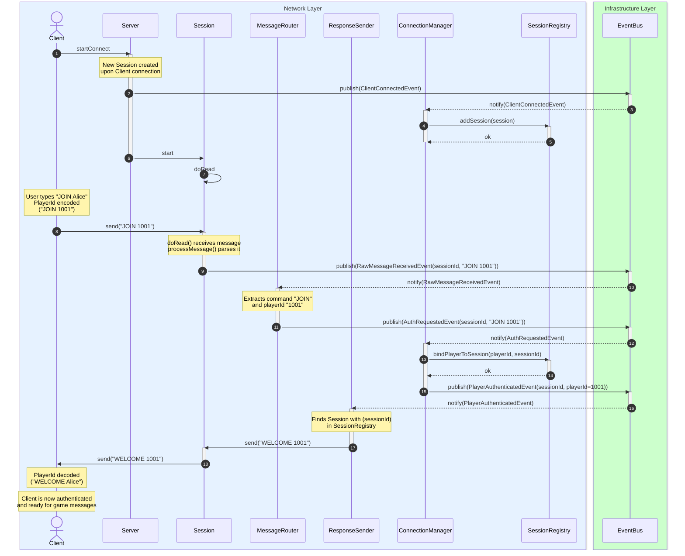

```mermaid
sequenceDiagram
    autonumber

    box rgb(230, 242, 255) Network Layer
        actor Client
        participant Server
        participant Session
        participant MessageRouter
        participant ResponseSender
        participant ConnectionManager
        participant SessionRegistry
    end

    box rgb(204, 255, 204) Infrastructure Layer
        participant EventBus
    end

    Client->>Server: startConnect
    activate Server
    Note over Server: New Session created<br/>upon Client connection
    Server->>EventBus: publish(ClientConnectedEvent)

    activate EventBus
    EventBus-->>ConnectionManager: notify(ClientConnectedEvent)
    deactivate EventBus

    activate ConnectionManager
    ConnectionManager->>SessionRegistry: addSession(session)
    activate SessionRegistry
    SessionRegistry-->>ConnectionManager: ok
    deactivate SessionRegistry
    deactivate ConnectionManager

    Server->>Session: start
    deactivate Server

    Session->>Session: doRead

    Note over Client: User types "JOIN Alice"<br/>PlayerId encoded<br/>("JOIN 1001")
    Client->>Session: send("JOIN 1001")
    
    activate Session
    Note over Session: doRead() receives message<br/>processMessage() parses it
    Session->>EventBus: publish(RawMessageReceivedEvent(sessionId, "JOIN 1001"))
    deactivate Session

    activate EventBus
    EventBus-->>MessageRouter: notify(RawMessageReceivedEvent)
    deactivate EventBus
    
    activate MessageRouter
    Note over MessageRouter: Extracts command "JOIN"<br/>and playerId "1001"
    MessageRouter->>EventBus: publish(AuthRequestedEvent(sessionId, "JOIN 1001"))
    deactivate MessageRouter

    activate EventBus
    EventBus-->>ConnectionManager: notify(AuthRequestedEvent)
    deactivate EventBus

    activate ConnectionManager
    ConnectionManager->>SessionRegistry: bindPlayerToSession(playerId, sessionId)

    activate SessionRegistry
    SessionRegistry-->>ConnectionManager: ok
    deactivate SessionRegistry

    ConnectionManager->>EventBus: publish(PlayerAuthenticatedEvent(sessionId, playerId=1001))
    deactivate ConnectionManager

    activate EventBus
    EventBus-->>ResponseSender: notify(PlayerAuthenticatedEvent)
    deactivate EventBus
    
    activate ResponseSender
    Note over ResponseSender: Finds Session with (sessionId)<br/>in SessionRegistry
    ResponseSender->>Session: send("WELCOME 1001")
    deactivate ResponseSender
    
    activate Session
    Session->>Client: send("WELCOME 1001")
    deactivate Session

    Note over Client: PlayerId decoded<br/>("WELCOME Alice")
    Note over Client: Client is now authenticated<br/>and ready for game messages
```
