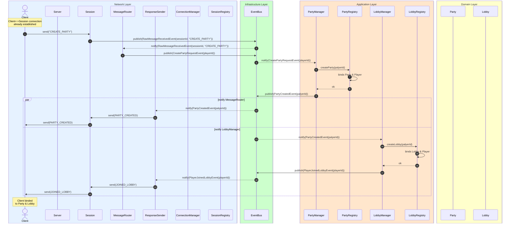

```mermaid
sequenceDiagram
    autonumber

    box rgb(230, 242, 255) Network Layer
        actor Client
        participant Server
        participant Session
        participant MessageRouter
        participant ResponseSender
        participant ConnectionManager
        participant SessionRegistry
    end

    box rgb(204, 255, 204) Infrastructure Layer
        participant EventBus
    end

    box rgb(255, 230, 204) Application Layer
        participant PartyManager
        participant PartyRegistry
        participant LobbyManager
        participant LobbyRegistry
    end

    box rgb(255, 255, 204) Domain Layer
        participant Party
        participant Lobby
    end

    Note over Client: Client<->Session connection<br/>already established

    Client->>Session: send("CREATE_PARTY")
    Session->>EventBus: publish(RawMessageReceivedEvent(sessionId, "CREATE_PARTY"))

    EventBus-->>MessageRouter: notify(RawMessageReceivedEvent(sessionId, "CREATE_PARTY"))
    MessageRouter->>EventBus: publish(CreatePartyRequestEvent(playerId))
    EventBus-->>PartyManager: notify(CreatePartyRequestEvent(playerId))

    PartyManager->>PartyRegistry: createParty(palyerId)
    PartyRegistry->>PartyRegistry: binds Party & Player
    PartyRegistry-->>PartyManager: ok
    PartyManager->>EventBus: publish(PartyCreatedEvent(palyerId))

    par notify MessageRouter 
        EventBus-->>ResponseSender: notify(PartyCreatedEvent(palyerId))
        ResponseSender->>Session: send(PARTY_CREATED)
        Session->>Client: send(PARTY_CREATED)

    and notify LobbyManager
        EventBus-->>LobbyManager: notify(PartyCreatedEvent(palyerId))

        LobbyManager->>LobbyRegistry: createLobby(palyerId)
        LobbyRegistry->>LobbyRegistry: binds Lobby & Player
        LobbyRegistry-->>LobbyManager: ok
        LobbyManager->>EventBus: publish(PlayerJoinedLobbyEvent(playerId))
        EventBus-->>ResponseSender: notify(PlayerJoinedLobbyEvent(playerId))

        ResponseSender->>Session: send(JOINED_LOBBY)
        Session->>Client: send(JOINED_LOBBY)
    end

    Note over Client: Client binded<br/>to Party & Lobby
```
