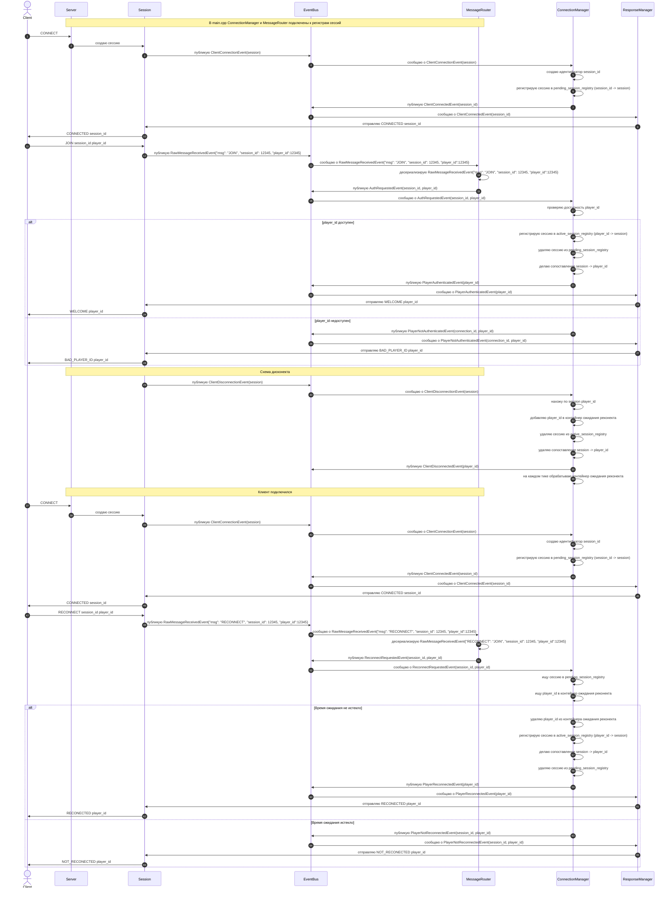

```mermaid
sequenceDiagram

autonumber

actor Client
participant Server
participant Session
participant EventBus
participant MessageRouter
participant ConnectionManager
participant ResponseManager

Note over Server,MessageRouter: В main.cpp ConnectionManager и MessageRouter подключены к регистрам сессий

Client ->> Server: CONNECT
Server ->> Session: создаю сессию
Session ->> EventBus: публикую ClientConnectionEvent(session)
EventBus ->> ConnectionManager: сообщаю о ClientConnectionEvent(session)
ConnectionManager ->> ConnectionManager: создаю идентифкатор session_id
ConnectionManager ->> ConnectionManager: регистрирую сессию в pending_session_registry (session_id -> session)
ConnectionManager ->> EventBus: публикую ClientConnectedEvent(session_id)
EventBus ->> ResponseManager: сообщаю о ClientConnectedEvent(session_id)
ResponseManager ->> Session: отправляю CONNECTED session_id
Session ->> Client: CONNECTED session_id

Client ->> Session: JOIN session_id player_id
Session ->> EventBus: публикую RawMessageReceivedEvent{"msg": "JOIN", "session_id": 12345, "player_id":12345}
EventBus ->> MessageRouter: сообщаю о RawMessageReceivedEvent{"msg": "JOIN", "session_id": 12345, "player_id":12345}
MessageRouter ->> MessageRouter: десериализирую RawMessageReceivedEvent{"msg": "JOIN", "session_id": 12345, "player_id":12345}
MessageRouter ->> EventBus: публикую AuthRequestedEvent(session_id, player_id)
EventBus ->> ConnectionManager: сообщаю о AuthRequestedEvent(session_id, player_id)
ConnectionManager ->> ConnectionManager: проверяю доступность player_id

alt player_id доступен
  ConnectionManager ->> ConnectionManager: регистрирую сессию в active_session_registry (player_id -> session)
  ConnectionManager ->> ConnectionManager: удаляю сессию из pending_session_registry
  ConnectionManager ->> ConnectionManager: делаю сопоставление session -> player_id
  ConnectionManager ->> EventBus: публикую PlayerAuthenticatedEvent(player_id)
  EventBus ->> ResponseManager: сообщаю о PlayerAuthenticatedEvent(player_id)
  ResponseManager ->> Session: отправляю WELCOME player_id
  Session ->> Client: WELCOME player_id
else player_id недоступен
  ConnectionManager ->> EventBus: публикую PlayerNotAuthenticatedEvent(connection_id, player_id)
  EventBus ->> ResponseManager: сообщаю о PlayerNotAuthenticatedEvent(connection_id, player_id)
  ResponseManager ->> Session: отправляю BAD_PLAYER_ID player_id
  Session ->> Client: BAD_PLAYER_ID player_id
end

Note over Server,MessageRouter: Схема дисконекта

Session ->> EventBus: публикую ClientDisconnectionEvent(session)
EventBus ->> ConnectionManager: сообщаю о ClientDisconnectionEvent(session)
ConnectionManager ->> ConnectionManager: нахожу по session player_id
ConnectionManager ->> ConnectionManager: добавляю player_id в контейнер ожидания реконекта
ConnectionManager ->> ConnectionManager: удаляю сессию из active_session_registry
ConnectionManager ->> ConnectionManager: удаляю сопоставление session -> player_id
ConnectionManager ->> EventBus: публикую ClientDisconnectedEvent(player_id)

ConnectionManager ->> ConnectionManager: на каждом тике обрабатываю контейнер ожидания реконекта

Note over Server,MessageRouter: Клиент подключился

Client ->> Server: CONNECT
Server ->> Session: создаю сессию
Session ->> EventBus: публикую ClientConnectionEvent(session)
EventBus ->> ConnectionManager: сообщаю о ClientConnectionEvent(session)
ConnectionManager ->> ConnectionManager: создаю идентифкатор session_id
ConnectionManager ->> ConnectionManager: регистрирую сессию в pending_session_registry (session_id -> session)
ConnectionManager ->> EventBus: публикую ClientConnectedEvent(session_id)
EventBus ->> ResponseManager: сообщаю о ClientConnectedEvent(session_id)
ResponseManager ->> Session: отправляю CONNECTED session_id
Session ->> Client: CONNECTED session_id

Client ->> Session: RECONNECT session_id player_id
Session ->> EventBus: публикую RawMessageReceivedEvent{"msg": "RECONNECT", "session_id": 12345, "player_id":12345}
EventBus ->> MessageRouter: сообщаю о RawMessageReceivedEvent{"msg": "RECONNECT", "session_id": 12345, "player_id":12345}
MessageRouter ->> MessageRouter: десериализирую RawMessageReceivedEvent{"RECONNECT": "JOIN", "session_id": 12345, "player_id":12345}
MessageRouter ->> EventBus: публикую ReconnectRequestedEvent(session_id, player_id)
EventBus ->> ConnectionManager: сообщаю о ReconnectRequestedEvent(session_id, player_id)
ConnectionManager ->> ConnectionManager: ищу сессию в pending_session_registry
ConnectionManager ->> ConnectionManager: ищу player_id в контейнер ожидания реконекта

alt Время ожидания не истекло
  ConnectionManager ->> ConnectionManager: удаляю player_id из контейнера ожидания реконекта
  ConnectionManager ->> ConnectionManager: регистрирую сессию в active_session_registry (player_id -> session)
  ConnectionManager ->> ConnectionManager: делаю сопоставление session -> player_id
  ConnectionManager ->> ConnectionManager: удаляю сессию из pending_session_registry
  ConnectionManager ->> EventBus: публикую PlayerReconnectedEvent(player_id)
  EventBus ->> ResponseManager: сообщаю о PlayerReconnectedEvent(player_id)
  ResponseManager ->> Session: отправляю RECONECTED player_id
  Session ->> Client: RECONECTED player_id
else Время ожидания истекло
  ConnectionManager ->> EventBus: публикую PlayerNotReconnectedEvent(session_id, player_id)
  EventBus ->> ResponseManager: сообщаю о PlayerNotReconnectedEvent(session_id, player_id)
  ResponseManager ->> Session: отправляю NOT_RECONECTED player_id
  Session ->> Client: NOT_RECONECTED player_id
end

```
