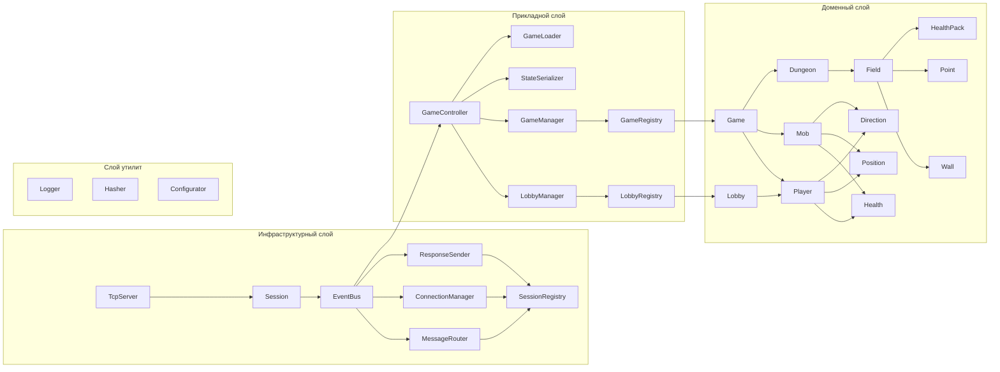

# !!!Документ в разработке и не утвержден тимлидом. Не руководствуйтесь им!!!
# Описание
Многопользовательское приложения игры Dungeeon Crawler.
# Слои
- __Доменный__ - игровая логика.
- __Прикладной__ - доступ к игровой логике.
- __Инфраструктурный(сетевой)__ - сетевые решения, обработка сообщений.
- __Утилиты__ - логгер, хэшер, конфигуратор.

## Доменный (domain) слой
Содержит компоненты, определяющие игровую механику.
### Компоненты
- __Point__ - точка с координатами (uint, uint или иначе - зависит от системы координат).
- __Position__ - позиция игрока (uint, uint или иначе - зависит от системы координат).
- __Direction__ - направление.
- __Health__ - здоровье (инкапсулирует логику урона и исцеления).
- __Player__ - игрок (здоровье, направление взгляда, позиция ...).
- __Lobby__ - лобби, группа игроков до начала игр.
- __Mob__ - противник  (здоровье, направление взгляда, позиция ...).
- __Game__ - игра, состояние нахождения в игре.
- __Dungeon__ - вариант подземелья (игровое поле, количество мобов/сложность???).
- __Field__ - игровое поле (4 точки, ограничивающие игровое пространство).
- __Wall__ - непроходимое препятствие
- __Stairs???__ - лестница??? 😅
- __Floor???__ - этаж??? 😅
- __Health pack__ - хилка??? 😅

## Прикладной (application) слой
Содержит компоненты, координирующие игровую механику.
### Компоненты
- __LobbyRegistry__ - регистр лобби, контейнер содержащий все лобби.
- __GameRegistry__ - регистр игровых сессий, контейнер содержащий все игровые сессии.
- __LobbyManager__ - менеджер лобби, осуществляет доступ к лобби, сохраненным в регистре лобби.
- __GameManager__ - менеджер игровых сессий, осуществляет доступ к игровым сессиям, сохраненным в регистре игр.
- __StateSerializator__ - сериализатор состояния игры (интерфейс), формат JSON???/CBOR??? Либо вернет какой-то DTO а инфраструктура его уже преобразует в нужный формат.
- __GameLoader__ - загрузчик игры (интерфейс), реализуем в инстраструктуре, формат хранения параметров JSON??? Если реализуем то нужно добавить сообщения с запросом на список карт и выбора карты.
- __GameController__ - точка доступа к игровой логике, координирует работу менеджеров, реагирует на тики - дергает сериализатор

## Инфраструктурный (infrastructure) слой
Содержит компоненты, реализующие интерфейсы прикладного слоя, содержит сетевые решения.
### Компоненты
- __TcpServer__ - асинхронный TCP сервер для создания соединения с клиентом: слушает порт, создает Session, публикует ClientConnectedEvent и запускает Session.
- __Session__ - связь клиента с сервером
- __SessionRegistry__ - регистр сессий, связи сессий с иидентификаторами игроков
- __ConnectionManager__ - редактирует регистр сессий - обработка соединений и индентификаторов игроков
- __MessageRouter__ - обработчик входящих сообщений, использует регистр сессий
- __ResponseSender__ - обработчик исходящих сообщений, использует регистр сессий
- __EventBus__ - шина связи компонентов

## Примерная схема связи компонентов

